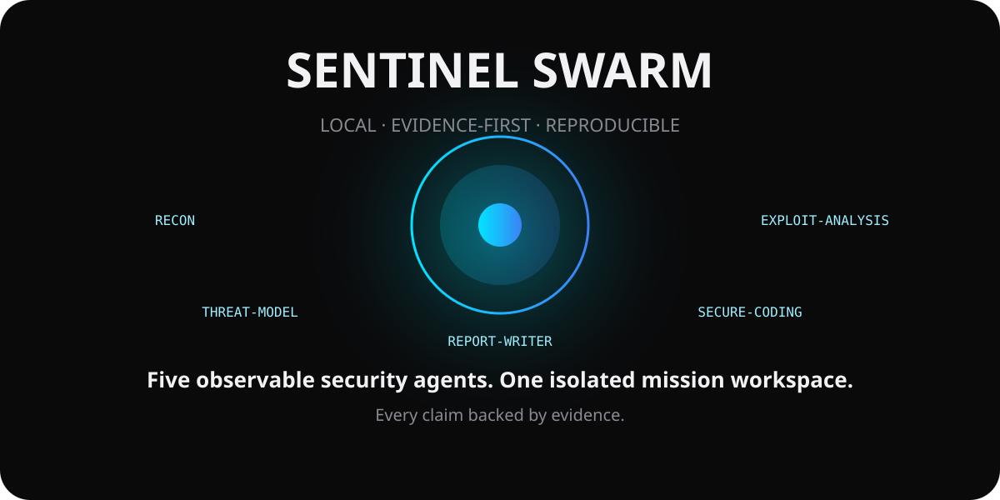

# Sentinel Swarm

**A local, evidence-first cybersecurity swarm you can actually watch work.**

Sentinel Swarm is an evidence-first, local multi-agent cybersecurity lab. v0.1 turns the original UI prototype into a reproducible backend-driven demo: five named agent roles inspect a real SSH configuration fixture, challenge unsupported claims, apply a hardening patch to an isolated mission copy, verify the result, and write an evidence-backed report.



## Why this repo is different

- **Truthful by construction:** v0.1 does not claim to scan networks or execute arbitrary shells.
- **Five observable roles:** RECON, EXPLOIT-ANALYSIS, THREAT-MODEL, SECURE-CODING, REPORT-WRITER.
- **Real evidence:** every mission records file path, line/excerpt where applicable, and SHA-256 hashes.
- **Real remediation:** the mission patches only its isolated workspace copy, then re-reads it to verify the fix.
- **Replay-ready ledger:** events are persisted to `data/<mission>/events.jsonl`.
- **Clone-and-run:** FastAPI + WebSocket UI, Docker support, tests, CI.

## Quick start

### Docker
```bash
git clone https://github.com/MiMindMendinc/sentinel-swarm.git
cd sentinel-swarm
docker compose up --build
```
Open `http://localhost:7777`.

### Python
```bash
python -m venv .venv
source .venv/bin/activate  # Windows: .venv\\Scripts\\activate
pip install -r requirements-dev.txt
uvicorn app.main:app --reload --port 7777
```

## What v0.1 actually does

1. Copies `range/ssh-misconfig/sshd_config` into a unique mission workspace.
2. RECON reads the file and records evidence.
3. EXPLOIT-ANALYSIS explains the risk without inventing a CVE.
4. THREAT-MODEL explicitly rejects unsupported claims.
5. SECURE-CODING changes `PermitRootLogin yes` and `PasswordAuthentication yes` to `no` in the isolated copy.
6. RECON re-reads the result and verifies both changes.
7. REPORT-WRITER creates `report.md` and the event ledger records the complete mission.

## Capability truth table

| Capability | v0.1 |
|---|---|
| Backend-driven mission | ✅ |
| WebSocket live events | ✅ |
| Evidence hashes | ✅ |
| Isolated mission workspace | ✅ |
| Real config remediation | ✅ |
| Post-change verification | ✅ |
| Network scanning | ❌ Not implemented |
| Arbitrary shell execution | ❌ Not implemented |
| Autonomous exploitation | ❌ Not implemented |
| Local LLM/Ollama | Planned |
| Swarm replay UI | Planned |

## Test
```bash
pytest -q
```

## API
- `GET /api/status` — truthful capability state
- `POST /api/missions` — run a mission synchronously
- `WS /ws/mission` — stream mission events into the UI

## Project layout
```text
app/        FastAPI + mission engine
static/     Sentinel Swarm UI
range/      safe reproducible demo fixtures
data/       generated mission workspaces (gitignored)
tests/      regression tests
docs/       architecture notes
```

## Roadmap
v0.1 establishes the evidence-first contract. Future releases can add Ollama/local models, stronger sandboxing, additional safe ranges, replay, signed evidence, agent/tool SDKs, and benchmarks without turning UI claims into fiction.

## License
MIT
