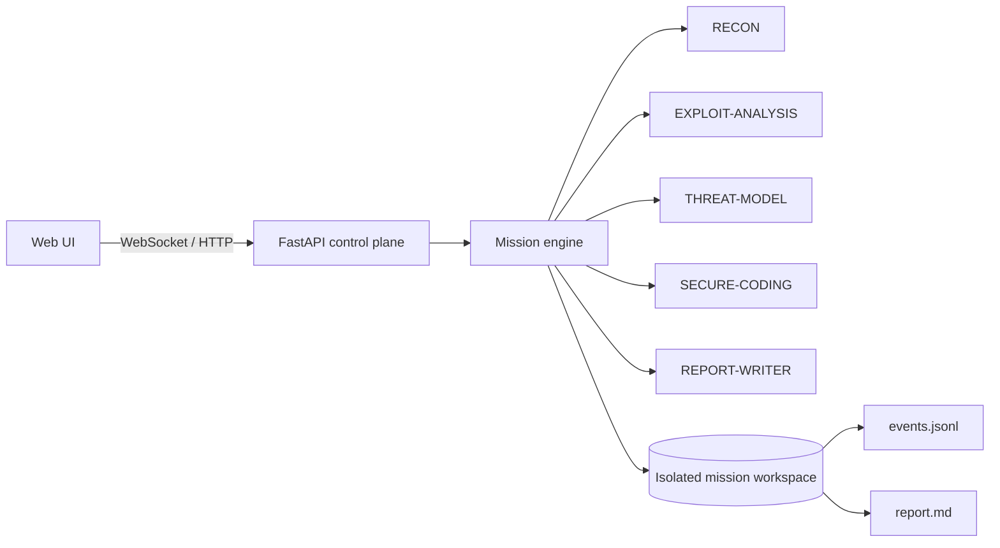

<div align="center">

# Sentinel Swarm

**Local AI cybersecurity agents you can actually watch work.**

[](https://github.com/MiMindMendinc/sentinel-swarm/actions/workflows/ci.yml)
[](https://www.python.org/)
[](https://fastapi.tiangolo.com/)
[](LICENSE)
[](#truthful-scope)
[](CONTRIBUTING.md)


**LOCAL · EVIDENCED · REPRODUCIBLE**

</div>

Sentinel Swarm is an evidence-first, local multi-agent cybersecurity lab. **v0.1.0** turns the original UI concept into a reproducible backend-driven demo: five named agent roles inspect a real SSH configuration fixture, challenge unsupported claims, apply a hardening patch to an isolated mission copy, verify the result, and write an evidence-backed report.

## Why this repo is different

- **Truthful by construction** — implemented capabilities are clearly separated from planned ones.
- **Five observable roles** — `RECON`, `EXPLOIT-ANALYSIS`, `THREAT-MODEL`, `SECURE-CODING`, and `REPORT-WRITER`.
- **Evidence, not theater** — missions record file paths, excerpts, and SHA-256 hashes.
- **Real remediation** — the demo modifies only an isolated mission copy and then re-reads it to verify the fix.
- **Replay-ready ledger** — every mission emits a six-event JSONL audit trail.
- **Clone-and-run** — FastAPI, WebSockets, Docker, tests, and CI are included.

## 60-second quick start

### Docker

```bash
git clone https://github.com/MiMindMendinc/sentinel-swarm.git
cd sentinel-swarm
docker compose up --build
```

Open **http://localhost:7777**.

### Python

```bash
python -m venv .venv
source .venv/bin/activate  # Windows: .venv\\Scripts\\activate
pip install -r requirements-dev.txt
uvicorn app.main:app --reload --port 7777
```

Then open **http://localhost:7777**. Interactive API docs are available at **http://localhost:7777/docs**.

## What the verified demo does

1. Copies `range/ssh-misconfig/sshd_config` into a unique mission workspace.
2. `RECON` reads the isolated copy and records evidence.
3. `EXPLOIT-ANALYSIS` explains the configuration risk without inventing a CVE.
4. `THREAT-MODEL` explicitly rejects unsupported claims.
5. `SECURE-CODING` changes `PermitRootLogin yes` and `PasswordAuthentication yes` to `no`.
6. `RECON` re-reads the file and verifies both hardening settings.
7. `REPORT-WRITER` creates a Markdown report while the mission writes an `events.jsonl` evidence ledger.

## Truthful scope

| Capability | v0.1.0 |
|---|---|
| Backend-driven mission | ✅ Implemented |
| WebSocket live events | ✅ Implemented |
| Evidence SHA-256 hashes | ✅ Implemented |
| Isolated per-mission workspace | ✅ Implemented |
| Real config remediation | ✅ Implemented |
| Post-change verification | ✅ Implemented |
| Markdown report + JSONL ledger | ✅ Implemented |
| Network scanning | ❌ Not implemented |
| Arbitrary shell execution | ❌ Not implemented |
| Autonomous exploitation | ❌ Not implemented |
| Local LLM / Ollama | 🧭 Planned |
| Swarm replay UI | 🧭 Planned |

## Architecture



The current "agents" are explicit deterministic roles in the mission engine. A live LLM is **not** required or claimed in v0.1.0.

## API

| Endpoint | Purpose |
|---|---|
| `GET /api/health` | Lightweight health check |
| `GET /api/status` | Truthful capability state |
| `POST /api/missions` | Run a mission synchronously |
| `WS /ws/mission` | Stream mission events into the UI |
| `GET /docs` | FastAPI interactive API docs |

## Test

```bash
pytest -q
```

The test suite verifies the health/status contract, real fixture remediation, report + ledger creation, HTTP validation, WebSocket mission streaming, and WebSocket input limits.

## Project layout

```text
.github/    CI, issue templates, PR template, Dependabot
app/        FastAPI control plane + mission engine
assets/     README artwork
static/     Sentinel Swarm mission console
range/      safe reproducible demo fixture
data/       generated mission workspaces (gitignored)
tests/      regression tests
docs/       architecture and design notes
```

## Security

Sentinel Swarm v0.1.0 is a **local safe demo**, not an offensive automation framework. Read [SECURITY.md](SECURITY.md) before extending it with tools that touch real systems.

## Contributing

Contributions are welcome — especially reproducible demo ranges, evidence formats, verification logic, accessibility improvements, and local-model adapters. See [CONTRIBUTING.md](CONTRIBUTING.md).

## Roadmap

The evidence-first contract comes before autonomy. Planned work includes local model adapters, stronger sandboxing, replay, signed evidence, additional safe ranges, benchmarks, and an agent/tool SDK. See [ROADMAP.md](ROADMAP.md).

## License

MIT — see [LICENSE](LICENSE).
