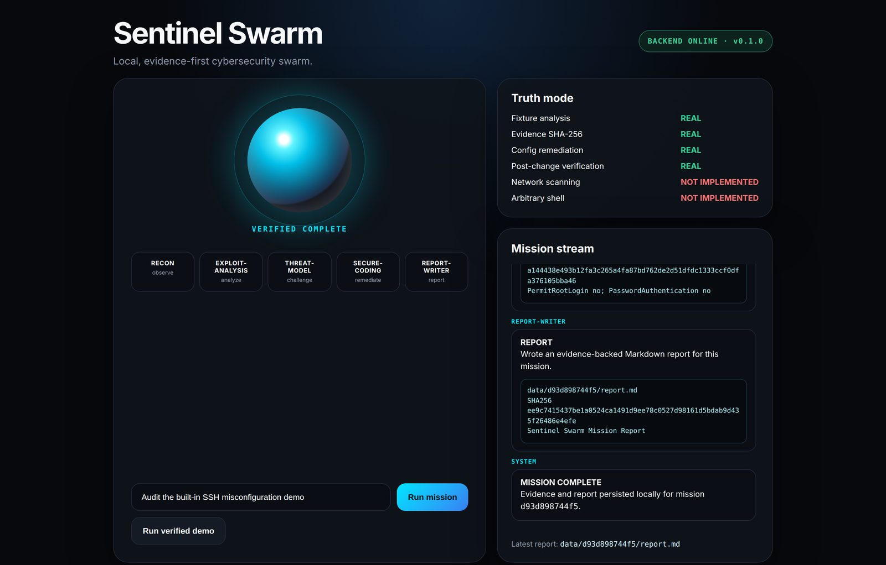
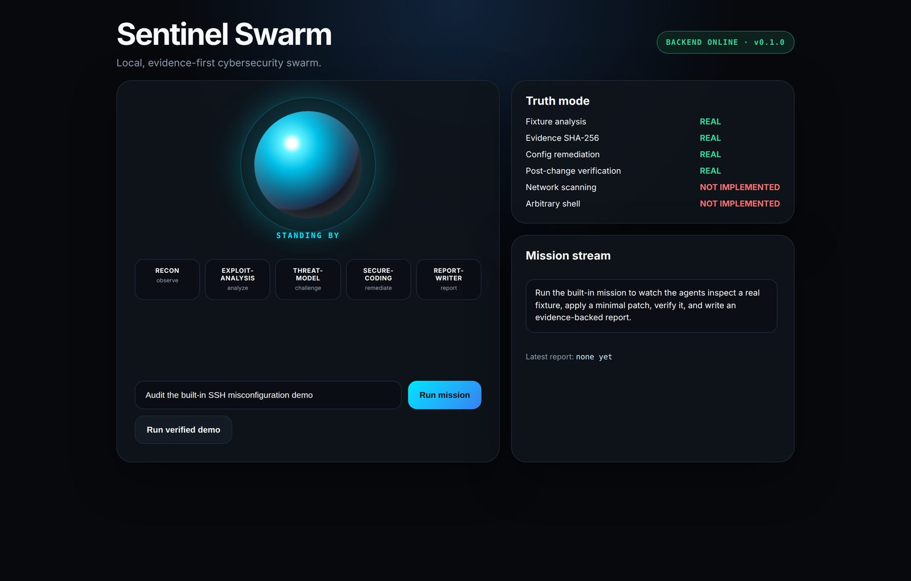
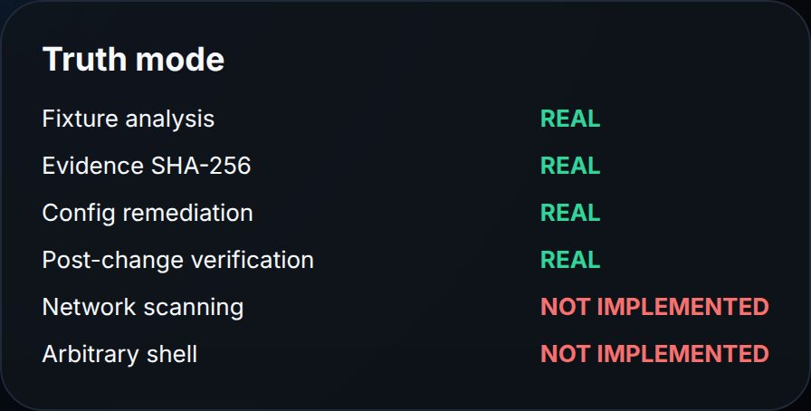
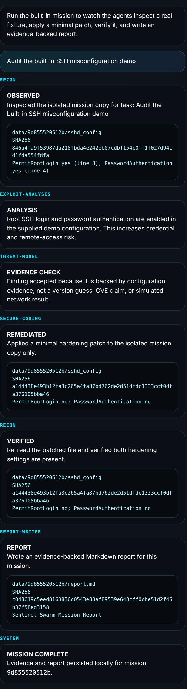
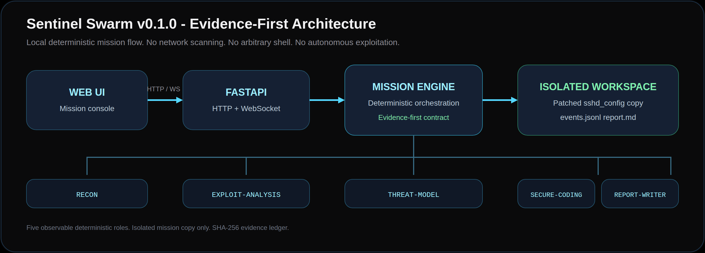

<div align="center">

# Sentinel Swarm

**Local AI cybersecurity agents you can actually watch work.**

[](https://github.com/MiMindMendinc/sentinel-swarm/actions/workflows/ci.yml)
[](https://github.com/MiMindMendinc/sentinel-swarm/releases)
[](https://www.python.org/)
[](docker-compose.yml)
[](tests/test_mission.py)
[](LICENSE)
[](#truthful-scope)

**LOCAL · EVIDENCE-FIRST · REPRODUCIBLE**



</div>

Sentinel Swarm is an evidence-first, local multi-agent cybersecurity lab. **v0.1.0** is a clone-and-run demo: five named agent roles inspect a real SSH configuration fixture, challenge unsupported claims, apply a hardening patch to an isolated mission copy, verify the result, and write an evidence-backed report.

## 60-second quick start

### Docker

```bash
git clone https://github.com/MiMindMendinc/sentinel-swarm.git
cd sentinel-swarm
docker compose up --build
```

Open **http://localhost:7777** and click **Run verified demo**.

### Python

```bash
python -m venv .venv
source .venv/bin/activate  # Windows: .venv\Scripts\activate
pip install -r requirements-dev.txt
pytest -q
uvicorn app.main:app --reload --port 7777
```

Then open **http://localhost:7777**. Interactive API docs: **http://localhost:7777/docs**.

<p align="center">
  
</p>

## What the verified demo does

1. Copies `range/ssh-misconfig/sshd_config` into a unique mission workspace.
2. `RECON` reads the isolated copy and records evidence.
3. `EXPLOIT-ANALYSIS` explains the configuration risk without inventing a CVE.
4. `THREAT-MODEL` explicitly rejects unsupported claims.
5. `SECURE-CODING` changes `PermitRootLogin yes` and `PasswordAuthentication yes` to `no`.
6. `RECON` re-reads the file and verifies both hardening settings.
7. `REPORT-WRITER` writes `report.md` and the mission persists a six-event `events.jsonl` ledger.

## Truthful scope

| Capability | v0.1.0 |
|---|---|
| Backend-driven mission | Implemented |
| WebSocket live events | Implemented |
| Evidence SHA-256 hashes | Implemented |
| Isolated per-mission workspace | Implemented |
| Real config remediation | Implemented |
| Post-change verification | Implemented |
| Markdown report + JSONL ledger | Implemented |
| Network scanning | Not implemented |
| Arbitrary shell execution | Not implemented |
| Autonomous exploitation | Not implemented |
| Local LLM / Ollama | Planned |
| Swarm replay UI | Planned |

<p align="center">
  
</p>

## Verified evidence

These SHA-256 digests are produced from the bundled fixture and are locked by the test suite:

| Artifact | Digest |
|---|---|
| Fixture before patch (`PermitRootLogin yes`, `PasswordAuthentication yes`) | `846a4fa9f53987da218fbda4e242eb07cdbf154c0ff1f027d94cd1fda554fdfa` |
| Isolated copy after verified patch (`PermitRootLogin no`, `PasswordAuthentication no`) | `a144438e493b12fa3c265a4fa87bd762de2d51dfdc1333ccf0dfa376105bba46` |

Each mission also writes `data/<mission_id>/events.jsonl` and `data/<mission_id>/report.md`. Generated workspaces are gitignored.

<p align="center">
  
</p>

## Architecture

<p align="center">
  
</p>

```text
WEB UI  --HTTP/WS-->  FASTAPI  -->  MISSION ENGINE  -->  ISOLATED WORKSPACE
                                         |
                    RECON · EXPLOIT-ANALYSIS · THREAT-MODEL · SECURE-CODING · REPORT-WRITER
                                         |
                              events.jsonl  +  report.md
```

The current "agents" are explicit deterministic roles in the mission engine. A live LLM is **not** required or claimed in v0.1.0.

## API

| Endpoint | Purpose |
|---|---|
| `GET /api/health` | Lightweight health check |
| `GET /api/status` | Truthful capability state |
| `POST /api/missions` | Run a mission synchronously |
| `WS /ws/mission` | Stream mission events into the UI |
| `GET /docs` | FastAPI interactive API docs |

## Test

```bash
pytest -q
```

The suite verifies the health/status contract, real fixture remediation, documented SHA-256 evidence, report + ledger creation, HTTP validation, WebSocket mission streaming, and WebSocket input limits.

## Project layout

```text
.github/    CI, issue templates, PR template, Dependabot, release workflow
app/        FastAPI control plane + mission engine
assets/     README screenshots and architecture diagram
static/     Sentinel Swarm mission console
range/      safe reproducible demo fixture
data/       generated mission workspaces (gitignored)
tests/      regression tests
docs/       architecture notes and GitHub Release copy
```

## Security

Sentinel Swarm v0.1.0 is a **local safe demo**, not an offensive automation framework. Read [SECURITY.md](SECURITY.md) before extending it with tools that touch real systems.

## Contributing

Contributions are welcome — especially reproducible demo ranges, evidence formats, verification logic, accessibility improvements, and local-model adapters. See [CONTRIBUTING.md](CONTRIBUTING.md).

## Roadmap

The evidence-first contract comes before autonomy. Planned work includes local model adapters, stronger sandboxing, replay, signed evidence, additional safe ranges, benchmarks, and an agent/tool SDK. See [ROADMAP.md](ROADMAP.md).

## License

MIT — see [LICENSE](LICENSE).
